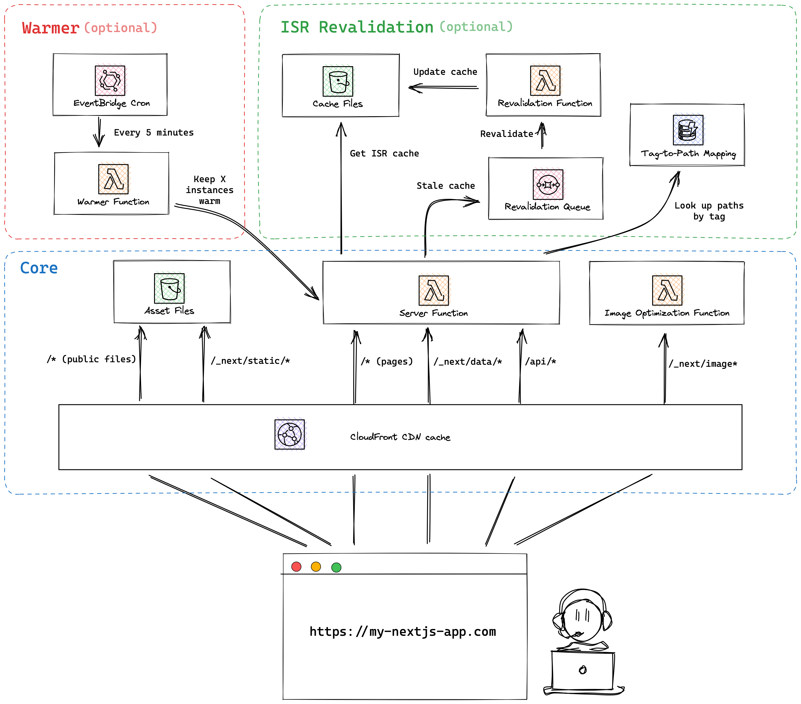

# Transitioning from a JSP/Servlet Monolith to AWS a Serverless SaaS Platform

*Authored by Tim Dodgson, Principal Software Engineer*

## Introduction

The software landscape is continuously evolving, and nowhere is this more evident than in the transition from traditional monolithic architectures to serverless paradigms. Our legacy JSP/Servlet application served us well but eventually became a bottleneck, unable to meet the demands of modern scalability and flexibility. This narrative details our strategic pivot to AWS Serverless, a journey marked by meticulous planning, technological innovation, and architectural reinvention.

## The Monolithic Conundrum

Faced with a JSP/Servlet monolith, we grappled with the limitations inherent in its architecture: challenging scalability during demand surges and sluggish adaptability to the market's volatility. These limitations were compounded by deep-rooted entanglement of components, making updates and scalability attempts cumbersome and risk-prone. A move towards a more decoupled architecture became inevitable.

## Embracing AWS Serverless: A Strategic Shift

Our resolution to dismantle the monolithic architecture was unanimous. AWS's suite of serverless offerings presented an elegant escape route, promising on-demand scalability and an event-driven operational model. We foresaw a future where our infrastructure would flex and scale as per the application load without manual intervention.

## Blueprinting the Rebuild

In the nascent stages, we charted our rebuild with a laser focus on defining precise objectives, target architecture, and potential roadblocks. Our strategic blueprint embraced the principles of the [Twelve-Factor App](https://12factor.net/) methodology to ensure our architecture would be robust, scalable, and maintainable in a serverless environment.

## Architecting the Serverless Foundation

With the serverless paradigm, we reimagined our infrastructure. AWS Lambda, Cloudfront, and DynamoDB were selected for their seamless integration, allowing for a resilient, event-driven architecture. Each component was selected to serve a distinct function within our microservices pattern, ensuring loose coupling and independent scalability.

## Detailed: AWS Infrastructure Design

Here, we envisage our AWS Infrastructure:

Our AWS infrastructure is architected around core serverless services:

- **Cloudfront** serves as the front door for all requests, directing traffic to the appropriate Lambda functions with efficiency and precision.
- **Lambda Functions** are utilized for executing business logic, each function is an independent, deployable unit that allows for rapid iteration and scaling.
- **DynamoDB** offers a highly performant NoSQL database with elastic scaling capabilities to handle our data persistence needs.
- **S3** is used for storing static assets, served efficiently via **CloudFront** distributions, ensuring high availability and low latency.
- **Lambda@Edge** and **CloudFront Functions** enhance our content delivery with compute capabilities at edge locations, facilitating a global reach with minimal latency.

This design enables a resilient, cost-effective architecture, optimizing both performance and cost.

## Metrics

The effective monitoring and consolidation of metrics are crucial in any modern software architecture. In our journey towards a serverless SaaS platform, we've leveraged [Dynatrace](https://www.dynatrace.com/) to ensure comprehensive metric management.

### Dynatrace Integration

Dynatrace plays a pivotal role in our metric management strategy. Its advanced observability and monitoring capabilities enable us to gain deep insights into the performance and behavior of our serverless applications. By integrating Dynatrace into our architecture, we've achieved:

- Real-time visibility into application performance, including latency, error rates, and resource utilization.
- The ability to trace requests and identify bottlenecks in our serverless functions.
- Proactive alerting and anomaly detection to address issues before they impact users.
- End-to-end transaction tracing to understand the flow of requests across our application stack.

By consolidating metrics using these tools, we are better equipped to proactively address issues, optimize performance, and continuously enhance the user experience.

Our commitment to metrics and monitoring remains unwavering as we strive for excellence in our serverless journey.

## Next.js: A Pragmatic Choice for Serverless SaaS

The selection of [Next.js](https://nextjs.org/) was driven by the need for a versatile framework capable of SSR, enhancing our application's performance and SEO. Our custom configuration extends Next.js for optimal operation in a serverless environment, ensuring that our SaaS platform is built on a foundation that promotes performance, scalability, and developer productivity.

## Migration and Data Transition Tactics

We ensured a non-disruptive migration by employing sophisticated data migration scripts and temporary bi-directional synchronization between the legacy and new systems. Middleware abstraction layers were designed to provide seamless interaction with our serverless components and legacy databases, maintaining business continuity.

## Benefits of Serverless Reengineering

Our serverless architecture resulted in tangible benefits:

- **Scalability**: We now handle workload spikes gracefully without the need for manual scaling.
- **Performance**: Cold start optimizations and connection pooling strategies have drastically improved our response times.
- **Cost-Effectiveness**: Pay-per-use pricing models of AWS services have led to a significant reduction in operational costs.

## The Path Forward: Iterative Innovation

With the foundational serverless architecture in place, we are committed to iterative innovation. Upcoming milestones include advanced monitoring with AWS CloudWatch and X-Ray, and further enhancements to our CI/CD pipeline using AWS CodePipeline and CodeBuild for even faster deployments and rollbacks.

## Reflections on the Serverless Journey

Migrating from a monolithic architecture to a serverless SaaS platform brought its share of technical hurdles and lessons:

1. **Complexity in Monolithic Disentanglement**: Decoupling interwoven components required an in-depth understanding of the monolithic system's intricacies.
2. **Serverless Mindset Adoption**: The team had to embrace a new paradigm of stateless computing and asynchronous execution.
3. **Data Migration Precision**: Migrating data to DynamoDB necessitated a highly precise mapping of relational data structures to NoSQL counterparts.
4. **Cost Management**: Implementing tagging and monitoring allowed us to manage costs at a granular level, avoiding potential cost overruns inherent in pay-as-you-go models.

## Conclusion

Our journey from a JSP/Servlet monolith to a serverless SaaS platform is a testament to strategic foresight and technological advancement. The AWS serverless ecosystem has empowered us to redefine our application architecture for unparalleled scalability and operational efficiency.

## About the Author

**Tim Dodgson**  
_Principal Software Engineer_  
Experienced in leading complex software projects and pioneering serverless solutions.

[LinkedIn Profile](https://www.linkedin.com/in/tim-dodgson/)

### Core Technologies

- [NEXT.js](https://nextjs.org/) for SSR and hybrid static & server rendering.
- [AWS Lambda](https://aws.amazon.com/lambda/) for scalable, event-driven compute service.
- [CloudFront](https://aws.amazon.com/cloudfront/) for content delivery
- [Amazon DynamoDB](https://aws.amazon.com/dynamodb/) for managed NoSQL database services.
- [AWS S3](https://aws.amazon.com/s3/) for static storage.
- [APPConfig](https://docs.aws.amazon.com/appconfig/) use AWS AppConfig to quickly deploy application configurations to applications of any size. 

